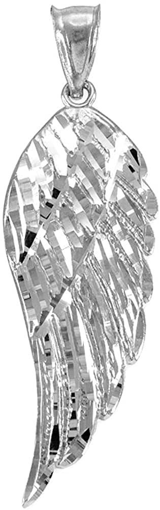

Looking for a beautiful and meaningful piece of jewelry? We've been checking out the Gold Angel Wing Charm Pendant from Religious Jewelry by FDJ, and it's caught our eye.

This charm pendant features a single angel wing design made of 14 karat gold. You can choose from yellow, white, or rose gold to match your style. The wing is crafted with layers of carved feathers, giving it a detailed and elegant look.

The pendant measures 1-1/4 inches from top to bottom, making it a nice size for everyday wear. It has a polished finish that gives it a bright shine. This piece can be worn on a necklace or added to a charm bracelet.

Made in the USA, this pendant is crafted by skilled artisans in Los Angeles. The company offers a lifetime warranty against defects, which shows their confidence in their product.

While many customers love this pendant, a few have mentioned it's smaller than they expected. It's a good idea to check the measurements before buying.

\[wpcode id="283"\]

### Bottom Line

The Gold Angel Wing Charm Pendant is a lovely choice for those seeking a meaningful piece of jewelry. Its quality craftsmanship and versatile design make it worth considering.

[Click here to buy the Gold Angel Wing Charm Pendant and add a touch of grace to your jewelry collection!](https://amzn.to/3DFbPbC)

## Overview of the 14K Gold Angel Wing Charm

This gorgeous angel wing charm is a heavenly piece of jewelry. Made from 14 karat gold, it comes in yellow, white, or rose gold options. The pendant features a single wing with carved feathers and hangs from a tapered bail. It measures 1-1/4 inches long, making it a nice size for everyday wear.

We like that this charm is versatile. It can be added to a necklace, chain, or charm bracelet. The high-shine polished finish gives it an eye-catching gleam. It's light but feels sturdy enough for regular use.

This wing charm could be a thoughtful gift for many occasions. Some buyers use it as a remembrance piece. While it's pretty, the back is hollow which makes it very lightweight. This may or may not be a plus depending on personal preference.

## Key Features

This elegant charm pendant offers a touch of celestial beauty in precious metal. Let's explore what makes this piece stand out:

### ANGELIC GRACE

The single wing design captures ethereal grace in a wearable form. Its textured surface adds visual interest and depth, catching the light as it moves. The tapered bail allows for easy attachment to necklaces or bracelets, making it versatile for different looks.

### THE GLEAM OF GOLD

Made from 100% genuine 14K gold, this charm shines with luxurious appeal. It comes in yellow, white, or rose gold options to suit different tastes and skin tones. The high-quality metal ensures lasting beauty and value.

### TOP QUALITY, AMERICAN MADE

Crafted in Los Angeles by skilled artisans, this pendant reflects true American craftsmanship. Each piece is designed and polished by hand, resulting in a charm that's both unique and well-made. The attention to detail speaks to the brand's commitment to quality.

### PERFECTLY GIFTABLE

This charm makes a thoughtful present for many occasions. Its sentimental design works well for birthdays, holidays, or just-because gifts. The versatile style appeals to different age groups, from young women to grandmothers.

We appreciate the care put into creating this piece. From its angelic design to its American origins, it offers both beauty and quality. The choice of gold colors and its adaptability to different jewelry types add to its appeal. While it's a lovely item, keep in mind that it doesn't come with a chain, so you'll need to pair it with your own necklace or bracelet.

## Visual Appeal and Design

The angel wing charm pendant catches the eye with its delicate, layered feather design. We love how the textured details add depth and dimension to this small yet striking piece. The tapered bail gives it a graceful flow when worn on a chain. At 1-1/4 inches long, it's a nice size - noticeable without being overpowering. The high-shine polish makes the gold really gleam and sparkle in the light. We appreciate that it comes in yellow, white, or rose gold options to suit different style preferences. While beautiful, some may find the single wing design a bit unbalanced visually compared to a pair. Overall, this charm has an ethereal, feminine look that many will find appealing.

## Pros and Cons

This gold angel wing charm offers a mix of elegance and symbolism. We've looked at its features and customer feedback to give you a clear picture of what to expect.

### Pros

- High-quality materials: Made from genuine 14K gold

- Versatile design: Can be added to necklaces or charm bracelets

- Multiple color options: Available in yellow, white, and rose gold

- American-made: Crafted by experienced goldsmiths in Los Angeles

- Lifetime warranty: Protected against defects

- Suitable for gifting: Comes ready for special occasions

### Cons

- Lightweight: Some users might prefer a heavier feel

- Hollow back: May not appeal to those wanting solid construction

- Price: Could be expensive for budget-conscious shoppers

The charm's delicate design catches the eye with its shine and texture. Its size works well for everyday wear without being too flashy. We found that customers appreciate its versatility and the quality of the craftsmanship.

While many love its lightweight nature, others might want a more substantial piece. The hollow back helps keep the weight down, but it might not meet everyone's expectations for a solid gold charm.

The pendant's American origin and lifetime warranty add value, but these features come at a price that might not fit all budgets. Still, for those seeking a meaningful, well-made gold charm, this angel wing could be a fitting choice.

## Craftsmanship and Material Quality

We found the craftsmanship of this gold wing charm to be impressive. The layered feather design shows attention to detail. Made from 14 karat gold, it has a nice weight without being too heavy. The pendant has a high shine that catches the light well. We noticed the polished finish gives it an elegant look. The tapered bail seems sturdy and well-made. While the back is hollow, this keeps it lightweight for comfortable wear. Overall, the quality appears good for the price point. The charm feels durable enough to withstand regular use. We think most buyers will be pleased with the material and construction of this piece.

## Customer Reviews

We've looked at what buyers are saying about this 14K gold angel wing charm. Many people love its size and lightweight feel, making it comfortable for everyday wear. The shine and texture catch the eye, adding a nice touch to existing jewelry. Buyers appreciate its quality, especially given the price point. Some use it as a remembrance charm or meaningful gift. While most feedback is positive, a few noted the hollow back. Overall, customers seem happy with their purchase, praising its beauty and value. The charm arrives quickly and meets expectations for those seeking a dainty yet eye-catching pendant.

## Conclusion

We've taken a close look at this 14K gold angel wing charm pendant. It's a pretty piece that catches the eye with its shine and texture. Many buyers like its size and lightweight feel. The pendant seems to work well for everyday wear and special occasions alike. While it's not heavy, most people find it sturdy enough to last. It's popular as a remembrance charm or meaningful gift. The price seems fair for a gold pendant of this quality. If you're looking for a dainty but eye-catching wing charm, this could be a good choice. Just keep in mind it's hollow-backed, which helps with the light weight but may affect durability for some wearers.
