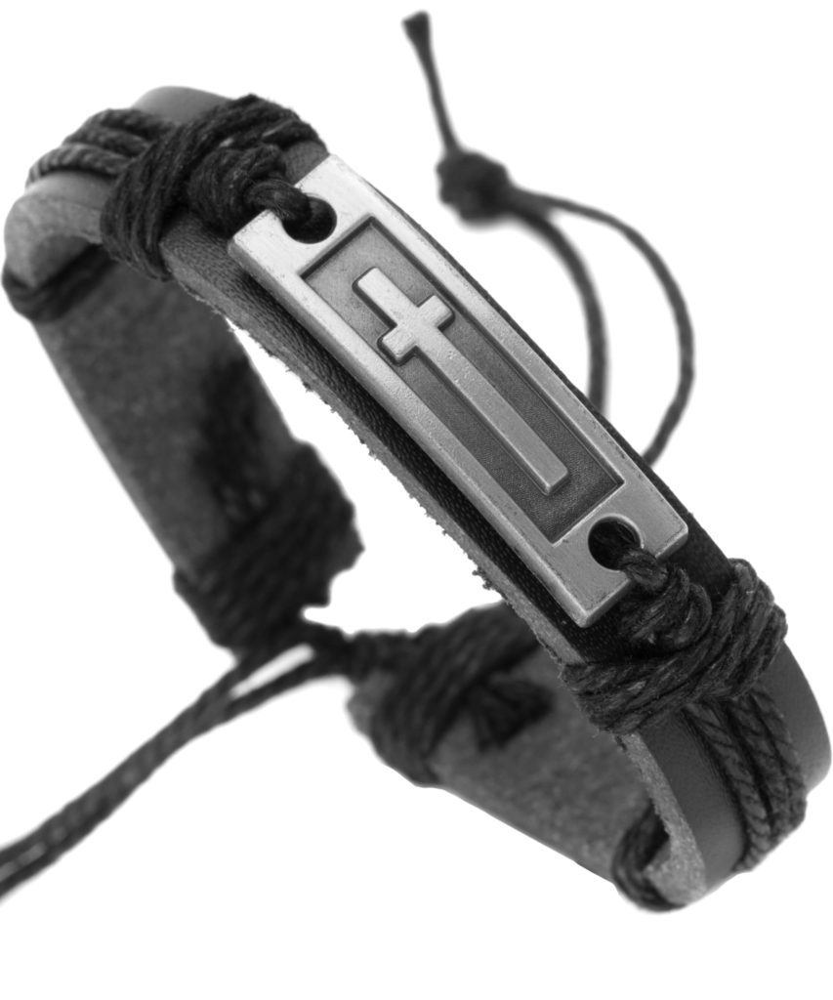

Shopping for a thoughtful gift or a personal accessory that shows your style and faith? We've recently taken a closer look at the Leather Cross Bracelet by Soul Statement and enjoyed what it has to offer.

The bracelet features quality leather that feels comfortable on the wrist and comes with an adjustable slip-knot closure, making it easy to fit various wrist sizes.

<figure>

<figcaption>

Version 1.0.0

</figcaption>

</figure>

We appreciate the cross pendant, which adds a touch of faith without being flashy.

In our experience, the craftsmanship is impressive, making it suitable for gifts on occasions like confirmations or baptisms.

The bracelet comes in a gift-ready pouch, easing the gifting process. While the leather feels sturdy, there are mixed opinions about the durability of the string, so some care might be needed.

\[wpcode id="283"\]

### Bottom Line

The Leather Cross Bracelet offers a simple yet meaningful accessory option. Whether for a gift or a personal purchase, consider buying it if you're looking for a stylish expression of faith. [Buy it here](https://amzn.to/4gDGHI6).

## Leather Cross Bracelet for Teens or Men: A Testament to Faith and Fashion

We tried the Soul Statement leather bracelet and found it quite stylish for teens and men. The leather feels soft and robust, suitable for daily wear.

The adjustable slip-knot closure allows a versatile fit, which makes it a good pick for many wrist sizes.

While it's designed nicely with a cross pendant, the string does seem fragile. A few users reported it breaking easily, which is worth considering.

On the plus side, it comes from a brand that's committed to important causes, such as supporting suicide prevention.

This bracelet can be a thoughtful gift for occasions like confirmations or Christmas due to its blend of fashion and faith significance. Though some find it sturdy, others note fragility, so we suggest handling it with care.

## Key Features

### Quality Leather Wristband

The comfort of the leather used in this bracelet surprised us. It's soft, making it comfortable for daily wear.

The slip-knot closure is adjustable, allowing it to fit various wrist sizes easily.

We noticed that the cross pendant doesn't fade or tarnish, which is great for maintaining its appearance over time.

This aspect contributes to its durability, especially for those who plan to wear it regularly.

### Gift-Ready Presentation

When we received the bracelet, it came in an elegant Soul Statement jewelry pouch.

This makes it perfect for gifting occasions like Christmas, Confirmation, or Easter.

It's suitable for men and teens, offering a thoughtful presentation without the need for extra wrapping, which we found convenient for last-minute gifts.

### Lifetime Jewelry Warranty

One of the standout features is the lifetime warranty. This reassures us about the bracelet's quality and the seller's commitment to customer satisfaction.

If anything happens to the bracelet—if it breaks or gets lost—we can get it replaced at no extra cost.

It's a solid assurance that backs up the product's quality claims.

### Easy-To-Wear Design

We appreciated the bracelet's design for its simplicity and ease of use.

By pulling both ends of the bracelet, it loosens enough for us to slide it over our hand. To tighten, we just pull the strings.

This easy mechanism comes in handy for quick, hassle-free wearing. There's no need to fuss with untying the knot, which saves us time and effort.

However, some reports suggest being cautious about the thinness of the string, as it could wear down with frequent adjustments.

## How This Bracelet Supports Suicide Prevention

Buying this bracelet isn't just about fashion or faith; it's about making a positive impact.

When we chose this bracelet, we were moved by how it contributes to an important cause. Each purchase helps fund suicide prevention efforts through donations to Save.org.

We believe in supporting brands that take action and make real-world changes.

It's powerful to know that a simple accessory can help support such a significant initiative. Although enjoying the bracelet’s design is a personal experience, being part of something bigger adds true value.

## Conclusion

The bracelet is a mix of comfort and faith. With a slip-knot closure, it fits most wrist sizes easily.

This feature is great for teens and men, making it both versatile and user-friendly.

**Materials:** It's crafted from smooth leather and includes a cross pendant.

A few users mentioned that the pendant's metal feels less durable, but it's still a popular choice for daily wear.

**Gift Potential:** It comes in a pouch, ready for gifting.

People appreciate its sincerity as a gift for occasions like confirmations, making it a safe choice for loved ones.

**Durability:** While many praise its craftsmanship, some have experienced issues with the string breaking.

Still, the lifetime warranty ensures peace of mind as replacements are easy.
