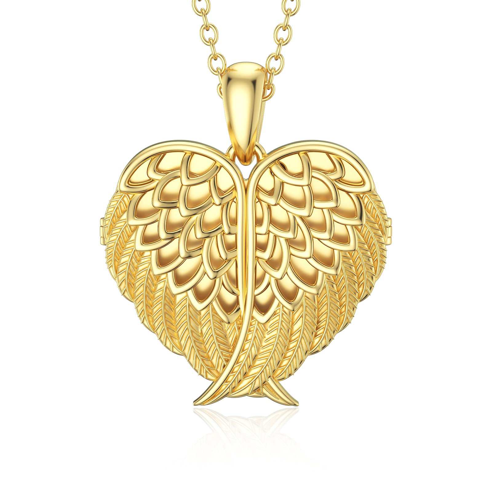

Looking for a heartfelt gift that keeps cherished memories close? We've been checking out the SOULMEET Angel Wing Heart Locket Necklace, and it seems to be a touching choice for those wanting to carry a special photo with them.

This gold-plated silver locket features a dainty heart shape with angel wings. It opens up to hold a small picture inside. The necklace comes on an 18-inch chain that can be adjusted up to 20 inches. It's a nice size for everyday wear without being too bulky.

Many buyers have given this locket as a gift to remember loved ones. The gold plating looks pretty and should be okay for most skin types. It comes in a gift box, so it's ready to give right away.

Some good points are the adjustable chain and the option to wear it with or without a photo inside. A few people said it was smaller than they expected, but most liked the petite size.

\[wpcode id="283"\]

### Bottom Line

The SOULMEET Angel Wing Locket is a sweet way to keep a photo of someone special close to your heart.

If you're looking for a meaningful gift, this locket could be a nice pick.

[Check out the SOULMEET Angel Wing Locket on Amazon](https://amzn.to/4gVIWpA) to see if it's the right choice for you or someone you care about.

## Overview of SOULMEET Angel Wing Heart Locket Necklace

We found this gold-plated locket to be a thoughtful piece of jewelry. It has a heart shape with angel wings and can hold a small photo inside. The chain is 18 inches long with a 2-inch extender.

The locket opens and closes with a clip design. It's made of 18K gold-plated silver, which should be gentle on sensitive skin. The pendant measures about 0.7 by 0.6 inches.

This necklace comes in a gift box, ready for giving. It could work well for many occasions like birthdays or Mother's Day. The small size makes it subtle enough for everyday wear.

One downside is that the locket may be too tiny for some people's taste. Also, the engraving on the back can be hard to read.

We think this locket offers a personal touch at a reasonable price point. It lets the wearer keep a loved one's photo close to their heart.

## Sentimental Value

This locket necklace holds deep meaning for many buyers. We found that people often give it as a thoughtful gift to loved ones who have lost someone special. The small size lets wearers keep cherished photos close to their hearts. Many customers use it to remember pets, family members, or friends who have passed away. The angel wing design adds to its emotional significance. While some felt the locket was tinier than expected, most appreciated its delicate look. The option to engrave a personal message makes it even more meaningful. Overall, this piece seems to bring comfort and spark fond memories for those who receive it.

## Key Features

The SOULMEET Angel Wing Heart Locket Necklace stands out with its thoughtful design and versatile appeal. We've examined this piece closely to highlight its most notable aspects.

### Quality and Materials

This locket is crafted from 18K gold-plated silver, offering a luxurious look without the high price tag. The chain is 1.5mm thick, providing durability for everyday wear. We appreciate that it's hypoallergenic, making it suitable for those with sensitive skin.

### Unique Design Elements

The heart-shaped locket features angel wings, symbolizing freedom and protection. Its clip opening allows easy access to insert or change photos. The pendant measures 0.7 x 0.6 inches, striking a balance between being noticeable and delicate.

### Adjustable Chain

The necklace comes with an 18-inch chain plus a 2-inch extender. This adjustability lets wearers customize the length to suit different necklines and personal preferences. The rolo-style chain adds to its overall durability.

### Gift-Readiness

SOULMEET packages this necklace in a jewelry gift box, eliminating the need for extra wrapping. It's sized appropriately for various gift-giving occasions, from birthdays to holidays. The option to include a personal photo makes it an especially thoughtful present.

## Pros and Cons

This locket necklace offers a touching way to keep loved ones close. We've looked at what customers are saying to give you a balanced view of its strengths and weaknesses.

### Pros

- The gold-plated silver design is both elegant and durable

- Its heart shape with angel wings adds a meaningful touch

- The locket opens easily to hold a small photo

- The chain is adjustable for a comfortable fit

- It comes in a gift box, ready for giving

### Cons

- The locket's small size may make it tricky to fit some photos

- Some users found the engraving on the back hard to read

- It might be too delicate for everyday wear

- The chain may be too thin for some people's taste

We found that many buyers loved this necklace as a gift for special occasions. Its size and design make it a hit with those who prefer subtle jewelry. But if you're looking for something larger or sturdier, you might want to explore other options.

## Customer Reviews

The locket necklace has gotten positive feedback from buyers. We found that many people bought it as a thoughtful gift for loved ones, often to remember someone who passed away. Users like the small, elegant size and how it looks in person. Some say it's prettier than the photos show. The locket seems to work well for keeping special pictures close. A few people mentioned it feels a bit delicate, so careful handling may be needed. The engraving option is popular, though one person found the text hard to read. Overall, customers seem happy with this meaningful jewelry piece. It has a 4.6 star rating from 79 reviews, showing most buyers are satisfied with their purchase.

## Customer Service Pledge

We're pleased to see SOULMEET's commitment to customer satisfaction. They promise full support in solving any issues that may arise. If buyers have questions or concerns, the company encourages reaching out. This pledge shows they stand behind their product. It's nice to know help is available if needed. Still, as with any online purchase, it's smart to read the fine print on return policies before buying.

## Conclusion

The SOULMEET locket necklace offers a touching way to keep loved ones close. We found its angel wing design and ability to hold photos appealing. While tiny in size, it makes up for this with elegant looks and sentimental value. The gold-plated finish adds a nice touch. Many buyers used it to remember lost family members or pets. The locket's petite nature works well for women but may be too small for men. Some users had minor issues with engraving, but most were happy with their purchase. For those seeking a meaningful, wearable keepsake, this necklace is worth considering. It combines style and sentiment in a compact package.
