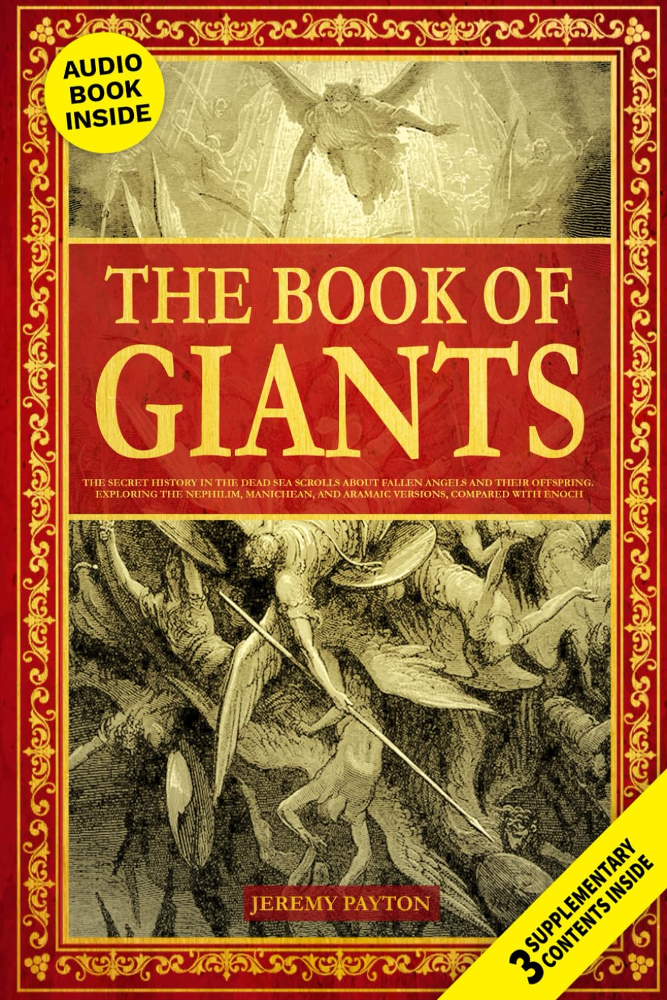

Ancient tales and hidden histories never fail to captivate us. We've been looking into "The Book of Giants," a text that dives into the mysterious world of fallen angels and their offspring as told in the Dead Sea Scrolls.

This book promises to take readers on a journey through Nephilim lore, Manichean texts, and Aramaic writings. It's part of a larger collection that explores Gnostic Gospels and other biblical texts, making it an intriguing read for those fascinated by ancient religious writings.

The book has gotten mixed feedback from readers. Some find it packed with fascinating information, while others point out editing issues and repetitive content. It seems to offer a good starting point for those new to this topic, but more seasoned readers might find it lacking in depth.

At just 100 pages, it's a quick read that could serve as an introduction to these ancient texts. The book is set to be released on July 10, 2024, by MINDSPARKPRESS LTD.

\[wpcode id="283"\]

## Bottom Line

For those curious about ancient religious texts and the stories of fallen angels, "The Book of Giants" might be worth a look. While it may have some flaws, it could spark interest in further exploration of this topic.

[Click here to check out "The Book of Giants" on Amazon and start your journey into ancient lore!](https://www.amazon.com/Book-Giants-Offspring-Exploring-Collection/dp/1916825184?tag=scriptmeaning-20)

## Overview of The Book of Giants: The Secret History in the Dead Sea Scrolls

We find this book to be a fascinating exploration of ancient texts. It digs into the mysterious Book of Giants found among the Dead Sea Scrolls. The work looks at stories of fallen angels and their giant offspring, the Nephilim.

The book connects these tales to other ancient writings. It touches on Manichean and Aramaic texts. It also links to Gnostic gospels. This gives readers a wide view of these old stories.

We like how it brings together different sources. This helps paint a fuller picture of these ancient beliefs. The writing is clear and easy to follow.

Some readers might want more in-depth analysis. But for most, this book offers a good starting point to learn about these intriguing ancient texts.

## Key Features

The Book of Giants offers a unique window into ancient texts and religious traditions. We found several standout features that make this work intriguing for readers interested in biblical history and apocryphal literature.

### Insight Into Ancient Texts

This book dives into the Dead Sea Scrolls, focusing on stories about fallen angels and their giant offspring. We think it's fascinating how it brings these ancient tales to life. The text explores Manichean and Aramaic sources, giving readers a broader view of these legendary beings.

### Unique Historical Perspective

The Book of Giants presents a different take on well-known biblical stories. It looks at the time before Noah's flood, a period not deeply covered in mainstream religious texts. We feel this adds depth to readers' understanding of ancient beliefs and folklore.

### Compact and Accessible Format

At just 100 pages, this book is a quick read. We like that it packs a lot of information into a small package. The 6 x 9 inch size makes it easy to carry around. It's a good option for readers who want to learn without committing to a lengthy tome.

### In-Depth Analysis of Fallen Angels and Nephilim

The book goes deep into the lore of fallen angels and their offspring, the Nephilim. We found the exploration of these mythical beings engaging. It connects ideas from various ancient sources, painting a rich picture of these supernatural entities.

While the book offers interesting content, we noticed some readers mentioned editing issues. This might affect the reading experience for some. Despite this, many found the subject matter captivating and informative.

## Authenticity and Research

We dug into the origins and scholarly analysis of this book to assess its credibility. The Dead Sea Scrolls provide fascinating glimpses into ancient beliefs about giants and fallen angels. Let's look at what experts say about the content.

### Scholarly Interpretations

Academics have mixed views on the book's accuracy. Some praise its translations of rare texts, while others question certain claims. We found:

- Several scholars confirm it covers authentic ancient writings

- A few note it sometimes blends fact and speculation

- Most agree it offers an accessible intro to a complex topic

- Experts suggest cross-checking major points with academic sources

The book seems to make a real effort to explore legitimate ancient texts. But readers should approach some interpretations with a critical eye. It's best used as a starting point for further research rather than the final word on giants in ancient lore.

## Pros and Cons

This ancient text offers a fascinating glimpse into early religious beliefs and mythologies. We've examined its contents and gathered insights to help potential readers decide if it's right for them.

### Pros

- Explores intriguing topics from ancient texts

- Provides translations of hard-to-find religious writings

- Gives context to biblical stories and characters

- Offers new perspectives on familiar narratives

- Appeals to those interested in religious history

### Cons

- Writing quality is inconsistent

- Contains typos and editing errors

- Some readers find it repetitive

- May not meet academic standards for scholarship

- Interpretations could be seen as speculative

The Book of Giants delves into captivating subjects, but it has some drawbacks. We found the content engaging for those curious about ancient religious texts. It sheds light on stories of fallen angels and their offspring, which may interest readers of biblical literature. The book includes translations of rare documents, making it valuable for those without access to original sources.

On the downside, we noticed issues with the writing. Some sentences are incomplete, and typos pop up throughout the text. This might frustrate readers looking for a polished work. The book also tends to repeat information, which can make it feel longer than necessary.

While the topic is fascinating, the academic rigor might not satisfy all readers. Some may find the interpretations too speculative. It's best suited for those with a casual interest in religious history rather than scholars seeking in-depth analysis.

## Evaluation of Customer Reviews

We've analyzed the customer feedback for this book on ancient giants and fallen angels. Readers find the topic fascinating, with many appreciating the exploration of lesser-known biblical narratives. The book's insights into pre-flood times and its translations of ancient texts are praised. Some reviewers note the book's depth of information.

On the flip side, several readers point out editing issues. Typos, incomplete sentences, and repetitive content are mentioned as drawbacks. A few customers feel the book could be more concise without losing its core message. Some also question the factual basis of certain claims.

Despite these criticisms, the overall rating is positive at 4.1 out of 5 stars. This suggests that for many readers, the book's intriguing subject matter outweighs its flaws. We think it's a mixed bag - captivating for those interested in biblical mysteries, but potentially frustrating for readers expecting polished, academic-level writing.

## Conclusion

We found this book on ancient texts to be a mixed bag. While it offers some intriguing glimpses into obscure biblical lore, the execution falls short in key areas. The translations and explanations provide food for thought, but frequent editing issues and repetitive writing hamper the reading experience. For those deeply curious about this niche topic, the book may still hold value. But casual readers should be aware of its flaws. We appreciate the attempt to shed light on these mysterious texts, even if the final product leaves something to be desired. In the end, your mileage may vary depending on your level of interest in the subject matter.
